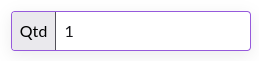

## Desafio front-end

Neste desafio, o candidato deverá construir um componente de Input de Números utilizando a biblioteca React. O objetivo é criar um componente reutilizável que permita aos usuários inserir apenas valores numéricos de forma fácil e intuitiva.

- O componente deve renderizar um campo de input de texto.
- O campo de input deve aceitar apenas números.
- O componente deve ser controlado.
- O componente deve fornecer uma propriedade para definir um valor padrão.

### Requisitos

#### Obrigatórios

- O componente deve ser criado o mais similar possível com as imagens fornecidas.
- O componente deve aceitar um valor padrão através da propriedade defaultValue e exibi-lo.
- O componente deve atualizar o valor quando o usuário digitar um número válido.
- O componente deve impedir a inserção de caracteres não numéricos.

##### Opcionais

- Suporte teclado numérico em dispositivos móveis
- Habilitar/desabilitar incremento quando se usa o scroll do mouse.
